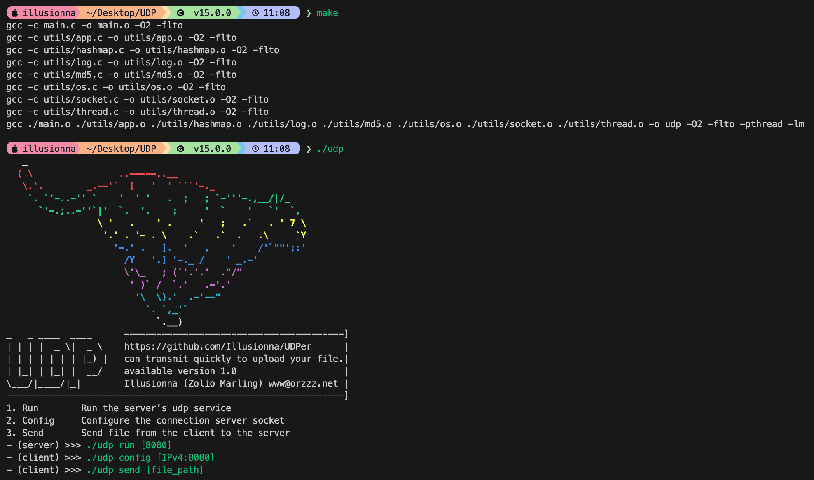

# UDPer: Reliable & High-Speed File Transmission

**UDPer** is a lightweight, high-performance file transmission tool written in C. It leverages the speed of the UDP protocol while implementing a reliability layer to ensure your data arrives intact and fast.

> "Transmitting data at the speed of UDP, with the reliability you expect from TCP."

---

## Features

* **Reliable UDP:** Implements custom mechanisms to handle packet loss and ordering, ensuring 100% data integrity.
* **High Performance:** Optimized with `O2` level compilation and Link Time Optimization (`-flto`) for maximum throughput.
* **Integrity Verification:** Built-in MD5 checksumming to verify files post-transmission.
* **Multi-threaded:** Powered by POSIX threads for efficient I/O and data processing.
* **Simple CLI:** Minimalist command-line interface with a cool ASCII art identity.
* **Cross-Platform Ready:** Modular design with abstraction layers for OS, Sockets, and Threads.

---

## Quick Start



### Build from Source

Ensure you have `gcc` and `make` installed on your system.

```bash
git clone https://github.com/Illusionna/UDPer.git
cd UDPer
make
```

### Usage

**Step 1: Start the Server (Receiver)**
Run this on the machine that will receive the file.

```bash
./udp run 8080
```

**Step 2: Configure the Client**
Tell the client where the server is located.

```bash
./udp config 192.168.1.100:8080
```

**Step 3: Send a File**
Start the high-speed upload.

```bash
./udp send /path/to/your/file.zip
```

---

## Project Structure

The project is built with modularity in mind:

* `utils/socket.c`: Core networking logic.
* `utils/md5.c`: Data integrity and hashing.
* `utils/thread.c`: Multi-threading management.
* `utils/hashmap.c`: Efficient data indexing for packet management.
* `utils/log.c`: Clean, informative terminal logging.

---

## Technical Overview

Unlike standard UDP, **UDPer** utilizes a sliding window and acknowledgement (ACK) system to guarantee delivery. By reducing the overhead found in the standard TCP handshake, it achieves significantly lower latency and higher effective bandwidth in lossy network environments.
